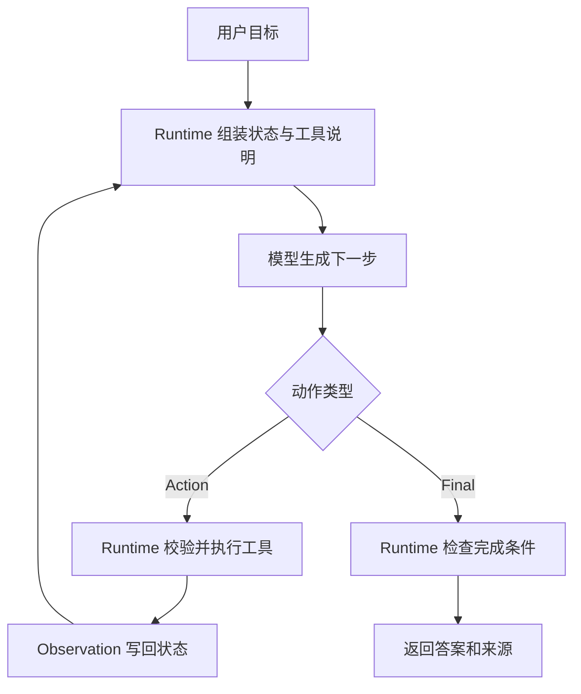

# ReAct范式

## 1. 从推理到行动

### 1.1 背景

ReAct 来自论文 *Synergizing Reasoning and Acting in Language Models*。它把 reasoning 和 acting 放进同一个循环：模型先根据目标和历史轨迹提出下一步动作，Runtime 执行工具，再把观察结果送回模型。这个结构适合资料检索、代码定位、网页操作、故障排查等路径依赖中间结果的任务。

普通问答只生成最终文本。CoT 会让模型展开中间推理，但仍停留在文本空间。ReAct 增加了外部动作，模型可以在搜索、读取、调用 API 之后修正下一步。这里要分清职责：模型产出候选动作，Runtime 负责解析、校验、执行、记录和停止。

### 1.2 最小循环



ReAct 的关键是循环结构。一次轨迹可以表示为 `Thought -> Action -> Observation` 的多轮序列，但工程实现中不必把内部思考逐字暴露给用户。更稳定的做法是让模型输出结构化动作，例如工具名、参数、下一步意图和停止信号。

## 2. Runtime 如何实现

### 2.1 结构化动作

ReAct Demo 经常让模型输出自然语言格式，但生产系统更适合使用 Function Calling 或 JSON schema。Runtime 应要求模型在每轮只选择一个明确动作，减少“既要搜索又要总结”的混合输出。

```json
{
  "action": "search_text",
  "args": {
    "query": "createAgentRuntime",
    "path": "src"
  },
  "reason": "定位 Runtime 初始化位置"
}
```

工具结果需要压缩成观察，而非原样塞回上下文。观察应包含路径、行号、摘要、截断状态、错误类型和耗时。这样模型能知道结果是否足够，Runtime 也能复盘失败。

### 2.2 Python 伪代码

```python
def run_react(goal, tools, model, max_steps=8):
    state = {"goal": goal, "steps": [], "evidence": []}

    for _ in range(max_steps):
        # 模型只提出候选动作，执行权留在 Runtime
        action = model.decide(state, tool_schemas=tools.schemas())

        if action["type"] == "final":
            return {"answer": action["answer"], "trace": state["steps"]}

        tool = tools.get(action["name"])
        args = tool.validate(action["args"])

        # 工具返回观察结果，状态记录可复盘证据
        observation = tool.run(args)
        state["steps"].append({"action": action, "observation": observation})

        if observation.get("source"):
            state["evidence"].append(observation["source"])

    return {"answer": "达到最大轮次，任务未完成。", "trace": state["steps"]}
```

示例里最重要的部分是 `validate`、`run` 和 `state`。模型输出错误参数时，Runtime 要返回结构化错误；工具超时时，状态要记录失败；证据不足时，模型应继续读取或请求澄清。

## 3. 适用边界

### 3.1 适合的任务

| 任务特征 | ReAct 的收益 |
| --- | --- |
| 需要边查边判断 | 搜索结果可以改变下一步查询 |
| 工具结果短而频繁 | 每轮观察容易回填 |
| 成功条件可逐步接近 | 状态可以记录证据和缺口 |
| 工具集合较小 | 模型选择动作更稳定 |

典型例子是“根据报错修复测试”。Agent 先搜索错误，再读相关文件，然后生成补丁，运行测试，继续根据失败日志修正。每一步都依赖上一步观察。

### 3.2 常见失败

| 失败类型 | 表现 | 工程处理 |
| --- | --- | --- |
| 循环搜索 | 多轮换关键词却没有新增证据 | 记录已搜索词，连续无增量后停止 |
| 工具误选 | 应读取文件却继续泛搜 | 分阶段暴露工具，收窄工具集 |
| 观察过长 | 工具结果挤占上下文 | 返回摘要和来源，原文留在日志 |
| 过早终止 | 证据不足就生成结论 | Runtime 检查来源覆盖和完成条件 |

### 3.3 与后续范式的关系

ReAct 是单步迭代范式。任务规模变大后，单步循环可能缺少全局计划，此时可以引入 Plan-and-Execute。输出质量要求更高时，可以在 ReAct 循环外加评估和修正，也就是 Reflection 类机制。

## 参考资料

- [ReAct: Synergizing Reasoning and Acting in Language Models](https://arxiv.org/abs/2210.03629)
- [OpenAI Function Calling](https://platform.openai.com/docs/guides/function-calling)
- [Anthropic: Building effective agents](https://www.anthropic.com/engineering/building-effective-agents)
