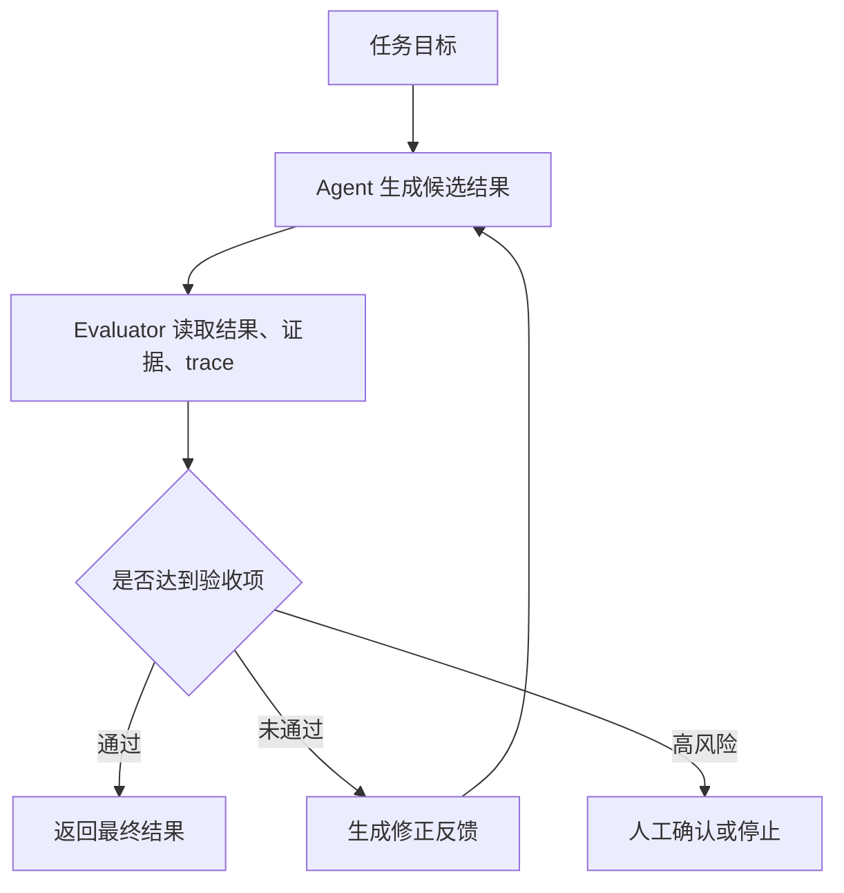
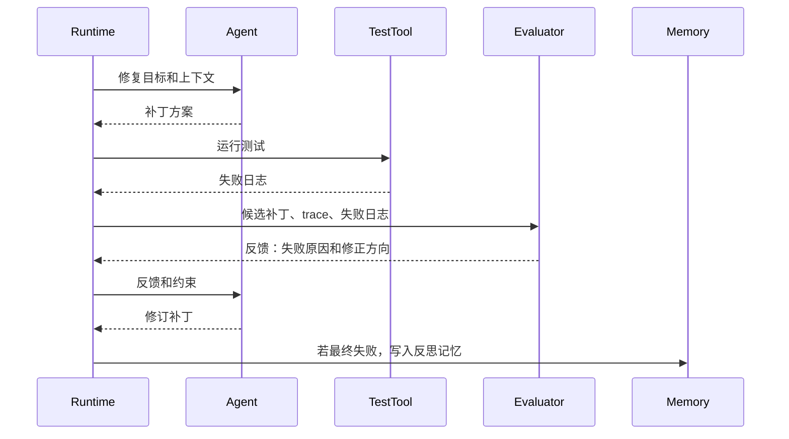

# Reflection与Reflexion

## 1. 从一次生成到自我修正

### 1.1 背景

Reflection 泛指模型在生成结果后进行评估、发现问题并修正输出的机制。Reflexion 则来自论文 *Reflexion: Language Agents with Verbal Reinforcement Learning*，它让 Agent 在失败后生成语言形式的反思记忆，并在后续尝试中使用这些记忆改进行为。两者常被混用，但工程实现时需要区分：Reflection 更像一个评估修正环节，Reflexion 更强调失败经验沉淀和下次调用。

这类机制出现的原因很直接：Agent 常常能完成大部分步骤，却在最后答案、工具参数、测试修复或证据归纳上出现细小错误。只靠一次模型调用，错误会直接暴露给用户；加一层评估与修正，可以把部分问题挡在发布前。

### 1.2 问题边界

| 场景 | 适合的反思方式 | 风险 |
| --- | --- | --- |
| 文档写作 | 检查证据覆盖、结构、遗漏 | 反思模型可能空泛批评 |
| 代码修复 | 根据测试失败生成下一步修正 | 可能扩大修改范围 |
| 工具调用 | 检查参数和工具选择是否合理 | 评估需要完整 trace |
| 长期学习 | 保存失败经验供下次任务检索 | 错误经验可能污染记忆 |

Reflection 不会自动提升事实正确性。它必须依赖可检查的证据、测试、规则或外部反馈。没有观察结果的自我评价，容易变成语气更自信的二次生成。

## 2. 运行机制

### 2.1 Evaluator-Optimizer 循环

Anthropic 把 evaluator-optimizer 归入常见工作流：一个模型生成答案，另一个评估器给出反馈，生成器据此修改。Agent 场景中，评估器可以是代码测试、规则评分器、LLM Judge 或人工审核。



关键点在于反馈要可执行。比如“内容不够好”没有帮助；“第 3 段提到 pgvector 成本低，但没有引用来源，请回到笔记或资料中补证据”可以直接驱动下一轮行动。

### 2.2 Reflexion 的记忆写入

Reflexion 的特殊之处在于把失败经验写成语言记忆。下一次类似任务开始时，Agent 检索这些经验，改变初始策略。它不更新模型参数，因此实现成本低，但记忆质量决定效果。

```python
def reflect_after_trial(task, trace, outcome):
    if outcome["passed"]:
        return None

    # 反思内容必须绑定失败证据，避免保存空泛经验。
    return {
        "task_type": task["type"],
        "failure": outcome["reason"],
        "lesson": "先运行最小测试定位失败，再扩大修改范围。",
        "evidence": trace[-3:],
        "expires_after_days": 30,
    }


def start_next_trial(task, memory_store):
    memories = memory_store.search(namespace=task["type"], query=task["goal"], limit=3)
    return {
        "goal": task["goal"],
        "reflections": [m["lesson"] for m in memories],
    }
```

这段代码强调两点：反思记忆只在失败后写入，并且要携带证据。没有证据的经验容易沉淀成噪声，后续任务会被错误建议误导。

## 3. 与 ReAct、计划的组合

### 3.1 三种嵌入位置

| 嵌入位置 | 机制 | 适合场景 |
| --- | --- | --- |
| 每轮动作后 | 检查工具选择、参数、观察结果 | 高风险工具调用 |
| 阶段完成后 | 检查计划步骤是否满足完成条件 | Plan-and-Execute |
| 最终输出前 | 检查答案、证据、格式、风险 | 写作、客服、代码修复 |

在代码 Agent 中，Reflection 通常跟测试结果绑定。模型修改代码后运行测试，失败日志就是评估依据；模型再根据失败日志提出补丁。这里的反思来自外部反馈，而非纯文本自评。

### 3.2 时序示例



评估反馈不要覆盖原始证据。最终调试时需要看到模型候选补丁、测试失败日志、评估器反馈和后续修订之间的关系。

## 4. 工程风险

### 4.1 常见失败

| 失败类型 | 表现 | 处理方式 |
| --- | --- | --- |
| 自我肯定 | 评估器重复生成器观点 | 使用测试、规则、证据字段约束评估 |
| 反馈空泛 | 只说“需要改进” | 要求反馈绑定段落、文件、工具结果 |
| 无限修正 | 多轮修改仍不达标 | 设置修正预算和人工接管条件 |
| 记忆污染 | 保存了错误经验 | 写入前检查证据，定期过期和降权 |
| 成本升高 | 每次任务多次模型调用 | 只在高风险阶段启用评估 |

Reflection 的效果来自可验证反馈。若任务没有测试、规则、证据或人工样本，优先补评估依据，再考虑反思循环。

## 参考资料

- [Reflexion: Language Agents with Verbal Reinforcement Learning](https://arxiv.org/abs/2303.11366)
- [Self-Refine: Iterative Refinement with Self-Feedback](https://arxiv.org/abs/2303.17651)
- [Anthropic: Building effective agents](https://www.anthropic.com/research/building-effective-agents)
- [OpenAI: Evaluate agent workflows](https://developers.openai.com/api/docs/guides/agent-evals)
