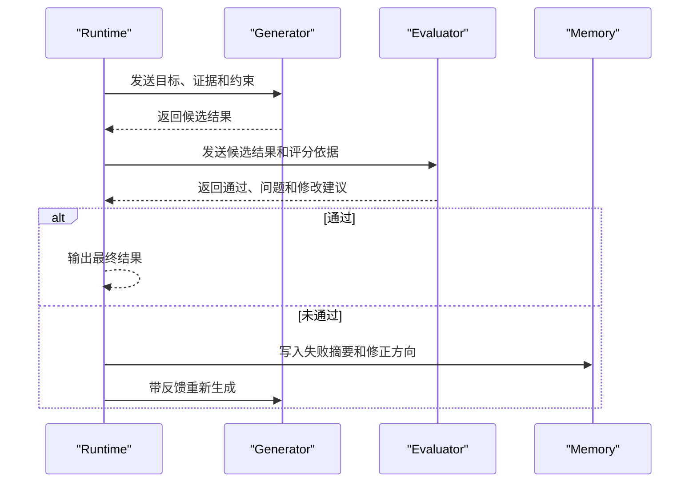

# Reflection与Reflexion

## 1. 生成后的评估循环

### 1.1 背景

Reflection 指 Agent 在生成结果或完成步骤后，引入评估和修正环节。它常用于代码生成、报告写作、复杂检索和多步骤任务。核心循环是：生成一个候选结果，评估它是否满足目标，若不满足则给出修改方向，再生成新版本。

Reflexion 是论文中更具体的一类方法。它让 Agent 把失败经验转成自然语言反馈，并存入后续尝试可使用的记忆中。它强调从失败轨迹中学习，而非只靠随机重试。

### 1.2 两层机制

| 机制 | 输入 | 输出 | 适用场景 |
| --- | --- | --- | --- |
| Reflection | 候选结果、目标、评分标准 | 评估意见和修正结果 | 单次任务质量改进 |
| Reflexion | 失败轨迹、环境反馈、任务目标 | 可复用经验记忆 | 多次尝试或相似任务 |

Reflection 可以独立作为 Evaluator-Optimizer 模式，也可以嵌入 ReAct 或 Plan-and-Execute。Reflexion 更依赖记忆模块，需要记录失败、原因和下一次可采用的策略。

## 2. 执行流程

### 2.1 基本时序



这里的 Evaluator 可以是规则、测试、静态分析、另一个模型或人工审核。能用程序判断的部分应优先使用程序，例如单元测试、JSON schema、权限校验和链接检查。模型评估适合语义覆盖、可读性、引用质量和风险遗漏。

### 2.2 停止条件

Reflection 容易陷入反复修改。Runtime 至少需要三类停止条件：达到最高迭代次数，评估器返回通过，连续两轮没有新增改进。对高风险任务，还要设置人工接管条件。

```python
def optimize(generator, evaluator, task, max_rounds=3):
    draft = generator(task)
    history = []

    for _ in range(max_rounds):
        review = evaluator(task, draft)
        history.append({"draft": draft, "review": review})

        # 评估器给出通过信号后立即停止
        if review["pass"]:
            return {"result": draft, "reviews": history}

        draft = generator(task, feedback=review["issues"])

    return {"result": draft, "reviews": history, "limited": True}
```

## 3. 工程取舍

### 3.1 评估器选择

| 评估器 | 优点 | 局限 |
| --- | --- | --- |
| 测试和规则 | 稳定、便宜、可复现 | 覆盖不了开放式质量 |
| LLM Judge | 能评估语义和表达 | 需要 Rubric 和校准 |
| 人工审核 | 适合高风险和争议样本 | 成本高，速度慢 |

代码修复可以先跑测试，再让模型审查 diff 风险。研究报告可以先检查引用来源和覆盖维度，再让模型评估逻辑连贯性。客服类任务需要优先检查策略合规和业务状态。

### 3.2 与记忆的关系

Reflection 的反馈如果只在当前轮使用，任务结束后就消失。Reflexion 会把失败原因、修正策略和环境反馈写入记忆，供后续任务检索。记忆写入需要结构化字段，例如任务类型、失败位置、修复动作、适用条件和过期策略。

### 3.3 风险

Reflection 会增加延迟和 token 成本。评估器质量差时，Agent 可能把正确结果改坏。工程上应先在有明确评分依据的任务中使用，再逐步扩展到开放任务。

## 参考资料

- [Reflexion: Language Agents with Verbal Reinforcement Learning](https://arxiv.org/abs/2303.11366)
- [OpenAI Evals](https://github.com/openai/evals)
- [Anthropic: Demystifying evals for AI agents](https://www.anthropic.com/engineering/demystifying-evals-for-ai-agents)
