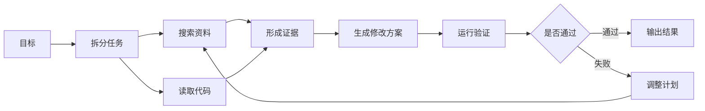

# 任务拆分与规划

## 1. 任务拆分的工程背景

### 1.1 长任务中的失控点

复杂任务会同时压迫上下文、工具选择和状态管理。模型一次性处理完整目标时，容易遗漏约束、混淆中间结果或跳过验证。任务拆分把目标变成可执行步骤，让 Runtime 能为每个阶段分配工具、记录状态和检查完成条件。

拆分可以由代码完成，也可以由模型生成。路径稳定的业务流程适合静态拆分，开放任务适合动态拆分。真实系统常混合使用：外层工作流固定阶段，阶段内部由 Agent 动态探索。

### 1.2 静态与动态

| 方式 | 控制者 | 适合场景 | 风险 |
| --- | --- | --- | --- |
| 静态拆分 | 代码和产品流程 | 审批、表单、固定工单 | 分支增多后维护困难 |
| 动态拆分 | 模型和 Runtime | 调研、修复、分析 | 步骤质量不稳定 |
| 混合拆分 | 工作流加 Agent | 生产级长任务 | 状态边界要清楚 |

以代码迁移为例，外层可以固定为“定位引用、修改代码、运行测试、总结风险”。定位引用阶段内部再由 Agent 根据搜索结果决定是否继续读文件或换关键词。

## 2. 规划技术脉络

### 2.1 CoT、ToT、GoT

CoT 让模型显式展开推理链，适合线性问题。Tree of Thoughts 把候选思路扩成树，允许搜索、评估和回退。Graph of Thoughts 进一步允许中间结果复用，适合多个子问题互相依赖的任务。

| 方法 | 结构 | 价值 | 工程成本 |
| --- | --- | --- | --- |
| CoT | 链 | 简单，适合单路径推理 | 缺少回退和分支比较 |
| ToT | 树 | 支持多候选探索 | 需要搜索和评分策略 |
| GoT | 图 | 支持复用中间结果 | 状态管理更复杂 |

在 Agent 工程中，这些方法通常不会原样照搬成论文实验，而会变成计划生成、候选步骤评估、任务图调度和 Replan。

### 2.2 任务图

任务图比线性计划更适合描述依赖和并行。Runtime 可以用图节点记录输入、输出、状态、预算和失败信息。并行执行前，应先确认节点之间没有写入冲突和共享资源竞争。

## 3. 自适应拆分

### 3.1 继续拆分的信号

一个步骤如果长期无法完成，通常需要继续拆。常见信号包括：工具结果过大、证据互相冲突、模型多次生成含糊动作、步骤完成条件无法判断、执行失败没有明确修复方向。

拆分后的子任务应更小、更可验证。例如“优化检索效果”可以拆成“确认失败查询样本”“分析召回缺失”“调整 chunk 策略”“运行回归评测”。

### 3.2 Replan 的状态记录

Replan 需要保留旧计划。Runtime 应保存计划版本、修改原因、受影响步骤和新的风险点。这样失败后可以回答：计划在哪一步改变，依据是什么，是否引入额外成本。

### 3.3 验收依据

任务拆分是否有效，最终看数据。可观测指标包括任务成功率、平均轮次、工具调用数、重复搜索率、人工接管率、成本和延迟。若拆分只增加步骤和成本，没有改善成功率，应回到更简单结构。

## 参考资料

- [Tree of Thoughts: Deliberate Problem Solving with Large Language Models](https://arxiv.org/abs/2305.10601)
- [Graph of Thoughts: Solving Elaborate Problems with Large Language Models](https://arxiv.org/abs/2308.09687)
- [Anthropic: Building effective agents](https://www.anthropic.com/engineering/building-effective-agents)
