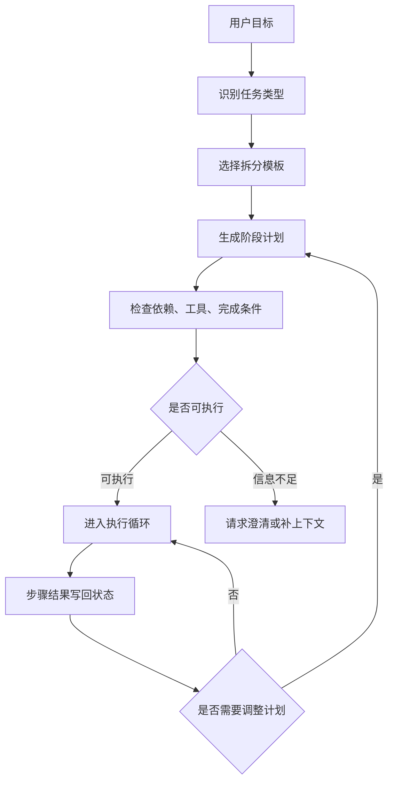

# 任务拆分与规划

## 1. 任务如何从目标变成步骤

### 1.1 背景

Agent 面对的用户目标经常是开放的：“整理这批材料”“修复这个 bug”“分析这次指标波动”。这些目标无法直接映射到一个工具调用。系统需要先把目标拆成可执行步骤，再逐步取得证据和产出物。经典规划问题强调状态、动作、目标和代价；LLM Agent 的规划继承了这个视角，只是动作空间变成工具调用、文件读写、模型生成和人工确认。

任务拆分的价值在于降低每一步的不确定性。一个好的拆分结果应当让 Runtime 知道当前阶段需要哪些输入、允许哪些工具、完成后产出什么、失败时如何回退。

### 1.2 拆分粒度

| 粒度 | 示例 | 优点 | 风险 |
| --- | --- | --- | --- |
| 目标级 | 修复登录问题 | 简洁 | 无法直接执行 |
| 阶段级 | 定位、修改、测试、总结 | 便于跟踪 | 阶段内部仍需动作选择 |
| 动作级 | 搜索关键字、读取文件、运行测试 | 可执行 | 计划过长，维护成本高 |
| 工具级 | 调用 `search_text` | 易校验 | 过早绑定实现细节 |

实际系统通常采用阶段级计划，再让每个阶段内部通过 ReAct 执行动作。这样既能保持全局方向，又能应对观察结果带来的变化。

## 2. 规划数据结构

### 2.1 从自然语言到结构化计划

```json
{
  "goal": "整理向量数据库选型笔记",
  "steps": [
    {
      "id": "collect",
      "description": "搜索并读取与向量数据库、pgvector、HNSW 相关的笔记",
      "inputs": ["notes_root"],
      "outputs": ["evidence_notes"],
      "allowed_tools": ["search_notes", "read_note"],
      "done_when": "至少读取三条相关笔记，并记录来源"
    },
    {
      "id": "compare",
      "description": "按成本、运维、召回、延迟整理对比表",
      "inputs": ["evidence_notes"],
      "outputs": ["comparison_table"],
      "allowed_tools": ["read_note"],
      "done_when": "每个结论都有来源"
    }
  ]
}
```

结构化计划能被 Runtime 使用。`inputs` 和 `outputs` 让系统知道步骤之间的依赖；`allowed_tools` 限制执行面；`done_when` 提供完成判断。自然语言计划若没有这些字段，只能作为提示，难以进入工程控制。

### 2.2 规划流程图



拆分模板可以来自工程经验，例如代码修复常见模板是“复现失败 -> 定位 -> 修改 -> 验证 -> 总结”；调研写作常见模板是“收集资料 -> 建立结构 -> 补证据 -> 成文 -> 校验引用”。

## 3. 规划算法与模型能力

### 3.1 常见方法对比

| 方法 | 机制 | 适合场景 | 局限 |
| --- | --- | --- | --- |
| Prompt 直接拆分 | 让模型输出步骤 | 原型、低风险任务 | 稳定性依赖提示词 |
| 模板化规划 | 按任务类型套用阶段模板 | 业务流程明确 | 覆盖不了长尾情况 |
| 搜索式规划 | 生成多条候选路径并评分 | 高价值复杂任务 | 成本高，评估器要求高 |
| 人工确认计划 | 执行前让用户审阅关键步骤 | 有写入、副作用或合规风险 | 交互成本增加 |

Tree of Thoughts 和 Graph of Thoughts 等研究提供了多路径搜索和评估思路，但生产系统常从更轻的结构化计划开始。先保证计划可执行、可校验、可恢复，再考虑复杂搜索。

### 3.2 最小规划器伪代码

```python
def plan_for_task(goal, task_type):
    templates = {
        "code_fix": ["reproduce", "locate", "patch", "test", "summarize"],
        "research": ["collect", "compare", "draft", "verify"],
    }
    stages = templates.get(task_type, ["collect", "execute", "verify"])

    return [
        {
            "id": stage,
            "allowed_tools": tools_for_stage(stage),
            "done_when": done_condition(stage),
        }
        for stage in stages
    ]


def validate_plan(plan):
    # 校验每个阶段都有工具范围和完成条件。
    for step in plan:
        if not step["allowed_tools"] or not step["done_when"]:
            return False
    return True
```

这个示例强调工程里的起点：先把任务类型和阶段模板稳定下来，再让模型填充具体查询词、文件路径或步骤说明。

## 4. 失败与治理

### 4.1 规划常见问题

| 问题 | 表现 | 处理方式 |
| --- | --- | --- |
| 目标误解 | 计划偏离用户真实意图 | 在计划前做意图确认或约束抽取 |
| 依赖缺失 | 后续步骤需要不存在的产物 | 计划校验时检查输入输出链 |
| 过度拆分 | 小任务被拆成十几步 | 设置最大阶段数，合并机械步骤 |
| 无法验收 | 步骤完成条件无法判断 | 每步绑定可观察产物 |
| 重规划频繁 | 执行轨迹反复推翻计划 | 记录重规划原因和次数 |

规划的工程价值来自可执行性。只要计划能限制工具、驱动状态、支持校验和复盘，它就能成为 Agent Runtime 的控制骨架。

## 参考资料

- [Tree of Thoughts](https://arxiv.org/abs/2305.10601)
- [Graph of Thoughts](https://arxiv.org/abs/2308.09687)
- [Anthropic: Building effective agents](https://www.anthropic.com/research/building-effective-agents)
- [LangGraph Persistence](https://docs.langchain.com/oss/python/langgraph/persistence)
