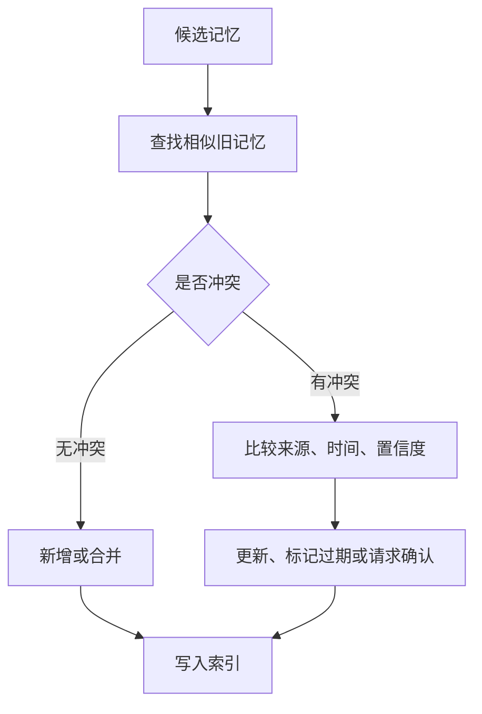

# 记忆压缩与更新

## 1. 压缩的必要性

### 1.1 上下文压力

Agent 任务越长，消息、工具结果和中间文件越多。若全部放进上下文，模型会遗漏早期约束，成本和延迟也会快速上升。记忆压缩把长轨迹变成短摘要、结构化事实或可检索片段。

压缩的目标是保留任务继续推进所需的信息，而非追求最短文本。关键决策、证据来源、失败原因、用户约束和未完成事项应优先保留。

### 1.2 压缩方法

| 方法 | 做法 | 适合场景 | 风险 |
| --- | --- | --- | --- |
| 滑动窗口 | 保留最近 N 轮 | 短任务、低风险对话 | 丢失早期关键约束 |
| 摘要压缩 | 把历史总结成短文本 | 长对话、研究任务 | 摘要可能遗漏细节 |
| 重要性过滤 | 按价值打分保留 | 证据很多时 | 打分器需要校准 |
| 结构化抽取 | 抽取事实、决策、待办 | 工程任务、业务流程 | schema 设计成本较高 |

真实系统常组合使用。保留最近窗口，同时把早期内容压缩成摘要，再把关键事实写入结构化记忆。

## 2. 更新机制

### 2.1 写入和合并

记忆更新要区分新增、覆盖、合并和失效。用户偏好变化时，应更新旧偏好并记录时间。业务规则变化时，应保留旧版本和新版本的来源。失败经验可以追加，但要避免同一失败被重复写入。

### 2.2 冲突字段

冲突是长期记忆中的常见情况。每条记忆应保留 `source`、`created_at`、`updated_at`、`confidence`、`scope` 和 `status`。这些字段让 Runtime 可以选择最新、最权威或最适合当前任务的记录。

## 3. 压缩质量评估

### 3.1 保真度

压缩后要检查关键信息是否仍在。可以用问题集验证：用户目标是什么，已经完成哪些步骤，哪些证据支持结论，哪些风险仍未解决。如果摘要答不上这些问题，就不能用于恢复任务。

### 3.2 任务贡献

压缩策略最终要看任务指标。常见评估包括恢复成功率、重复工具调用率、用户纠正率、上下文长度、成本和延迟。若压缩降低了上下文长度却导致任务失败增加，应调整保留字段。

### 3.3 隐私和删除

记忆更新还要支持删除和遗忘。用户要求删除偏好或敏感信息时，系统应能定位相关记录、索引和备份策略。对企业系统，记忆存储应遵守数据最小化和访问审计。

## 参考资料

- [MemGPT: Towards LLMs as Operating Systems](https://arxiv.org/abs/2310.08560)
- [Generative Agents: Interactive Simulacra of Human Behavior](https://arxiv.org/abs/2304.03442)
- [LangGraph Long-Term Memory](https://docs.langchain.com/oss/python/langchain/long-term-memory)
