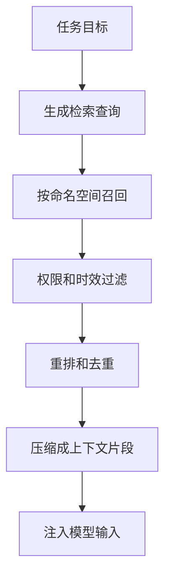

# 记忆存储与检索

## 1. 存储载体

### 1.1 按访问方式选择

记忆存储不只有向量库。不同记忆类型需要不同载体。用户偏好适合结构化表，长文档摘要适合向量检索，实体关系适合图结构，完整轨迹适合对象存储或日志系统。

| 载体 | 适合内容 | 检索方式 |
| --- | --- | --- |
| 上下文窗口 | 当前任务摘要 | 直接注入 |
| 关系数据库 | 用户偏好、实体事实、权限 | 精确查询 |
| 向量数据库 | 经验、文档片段、语义事实 | 相似度检索 |
| 图数据库 | 实体关系和依赖 | 图遍历 |
| Trace Store | 完整轨迹和调试证据 | trace id、标签、时间 |

存储选择应服务读取方式。若未来总是按用户 id 精确读取，就不需要先放进向量库。若未来按自然语言语义召回，embedding 和重排更合适。

### 1.2 命名空间

记忆必须区分用户、团队、项目、环境和权限。缺少命名空间会导致信息串扰。例如个人偏好不应影响团队默认策略，测试环境经验不应直接用于生产操作。

## 2. 检索流程

### 2.1 读路径



召回后必须过滤权限和时效。旧记忆、低置信度记忆和与当前任务无关的记忆不应进入上下文。重排可以结合相似度、时间、来源可信度、任务类型和使用频率。

### 2.2 注入方式

记忆注入要短而可追溯。推荐格式包含内容、来源和适用范围。

```text
相关记忆：
1. 项目使用 VitePress 构建。来源：project_fact/2026-06-24。
2. 用户偏好文章章节不超过三级。来源：user_preference/confirmed。
```

模型看到记忆后仍应以当前用户请求为准。Runtime 可以把记忆标记为辅助上下文，避免它覆盖更高优先级指令。

## 3. 检索质量

### 3.1 指标

| 指标 | 含义 |
| --- | --- |
| 命中率 | 关键记忆是否被召回 |
| 噪音率 | 无关记忆占比 |
| 时效正确率 | 过期记忆是否被过滤 |
| 权限正确率 | 是否避免越权读取 |
| 任务贡献度 | 记忆是否改善最终结果 |

记忆系统要通过任务结果验证。召回很多内容不代表有价值。若记忆增加了上下文噪音，应收紧召回和注入策略。

### 3.2 失效策略

长期记忆会过期。可以使用固定过期时间、来源版本、权威系统校验和用户确认来控制失效。对业务规则类记忆，优先读取最新政策或 API，而非依赖旧摘要。

## 参考资料

- [LangGraph Memory](https://docs.langchain.com/oss/python/langchain/long-term-memory)
- [MemGPT: Towards LLMs as Operating Systems](https://arxiv.org/abs/2310.08560)
- [Pinecone: What is a Vector Database](https://www.pinecone.io/learn/vector-database/)
