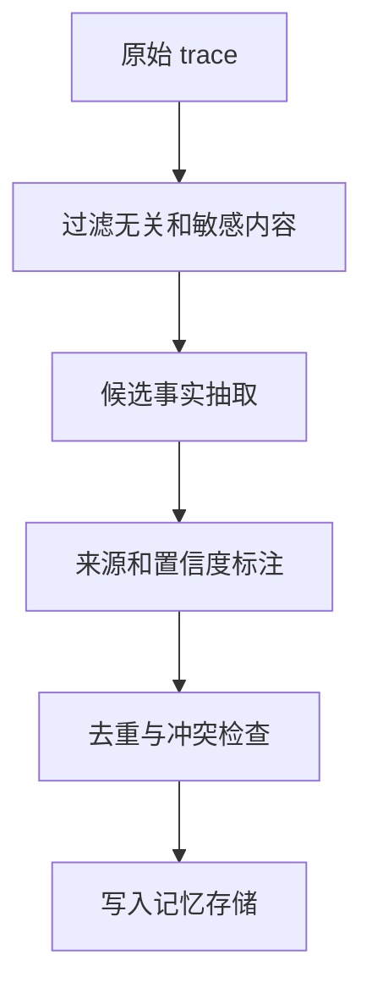

# 记忆抽取

## 1. 从原始轨迹到可用记忆

### 1.1 抽取目标

Agent 轨迹包含用户消息、模型回复、工具调用、错误、外部资料和最终结果。直接保存完整轨迹会带来噪音、隐私风险和检索困难。记忆抽取负责把原始轨迹转成可复用信息。

抽取的目标是得到高信号、可验证、可更新的记录。它应说明来源、置信度、适用范围和过期条件。没有来源的记忆很难复核，长期使用会放大错误。

### 1.2 抽取对象

| 对象 | 示例 | 用途 |
| --- | --- | --- |
| 用户偏好 | 偏好 Markdown 表格输出 | 个性化输出 |
| 项目事实 | 仓库使用 pnpm 和 Vitest | 后续代码任务 |
| 业务规则 | 退款超过金额需要审批 | 工具调用前校验 |
| 决策记录 | 已放弃方案 A，采用方案 B | 防止重复讨论 |
| 失败经验 | `rg` 无结果时应搜索别名 | 改善下一次策略 |
| 实体关系 | 用户、订单、项目、环境之间的关系 | 结构化查询 |

## 2. 抽取流程

### 2.1 基本链路



第一步应过滤敏感内容和低价值噪音。第二步可以使用规则或模型抽取候选事实。第三步必须保留来源，例如 trace id、消息 id、文件路径、工具返回。第四步检查已有记忆，决定新增、更新、合并或丢弃。

### 2.2 抽取 schema

```json
{
  "memory_type": "project_fact",
  "subject": "liyyro",
  "content": "项目文档使用 VitePress 构建。",
  "source": "trace:2026-06-24:agent-docs",
  "confidence": 0.94,
  "expires_at": null
}
```

结构化字段能让检索和更新更稳定。不同类型的记忆可以有不同 schema，例如用户偏好需要作用域，业务规则需要生效时间，失败经验需要适用条件。

## 3. 质量控制

### 3.1 过滤规则

不应写入以下内容：一次性临时信息、未验证推测、用户明确不希望保存的内容、敏感凭证、受权限限制的数据、已经过期的业务状态。写入前可以用规则和模型共同判断。

### 3.2 冲突处理

新记忆和旧记忆冲突时，不要简单覆盖。应记录冲突来源、时间和置信度。对业务规则、用户身份和权限类信息，应优先使用权威系统，而非对话抽取。

### 3.3 人工确认

用户偏好和低风险经验可以自动写入。涉及隐私、身份、权限、财务和合规的信息，应要求明确授权或来自权威工具结果。

## 参考资料

- [LangGraph Long-Term Memory](https://docs.langchain.com/oss/python/langchain/long-term-memory)
- [Generative Agents: Interactive Simulacra of Human Behavior](https://arxiv.org/abs/2304.03442)
- [OpenAI: Practices for governing agentic AI systems](https://openai.com/index/practices-for-governing-agentic-ai-systems/)
