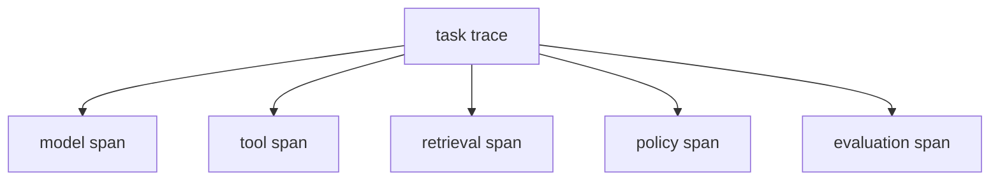

# Agent可观测性

## 1. 观察对象

### 1.1 AI 行为证据

Agent 可观测性要覆盖传统系统指标，也要覆盖模型和工具行为。Trace 的价值在于解释 Agent 看到了什么、做了什么、结果如何被评价。

| 层级 | 信号 |
| --- | --- |
| 用户会话 | session、入口、意图、轮次、反馈 |
| Agent 决策 | plan、step、selected_tool、fallback |
| 模型调用 | model、prompt version、tokens、latency、cost |
| 工具调用 | tool、arguments hash、status、error、side_effect |
| 检索/RAG | query、doc ids、scores、citation coverage |
| 环境状态 | 初始状态、状态变更、最终状态 |
| 安全合规 | PII、policy check、blocked action |
| 评分反馈 | online score、用户评分、人工审核 |

不要把敏感内容无差别写入日志。PII、密钥、支付信息和受限内容应脱敏、采样或分级授权查看。

### 1.2 Trace 结构

每个 span 应有 trace id、step id、耗时、状态和错误类型。这样一次失败可以从用户反馈追到模型调用、工具结果和最终状态。

## 2. 仪表盘

### 2.1 四类视图

| 仪表盘 | 指标 |
| --- | --- |
| 业务质量 | 任务成功率、人工接管率、负反馈 |
| Agent 行为 | 工具分布、重复调用、澄清率、拒答率 |
| 系统性能 | P50/P95/P99 延迟、成本、超时 |
| 安全治理 | PII 告警、越权动作、危险工具阻断 |

告警不应只看服务错误率。Agent 还要关注线上质量分下降、某类意图成功率突降、工具调用数异常上升、trace 完整率下降和安全策略命中异常。

### 2.2 根因分析

质量下降时，先定位业务意图、用户群、模型版本、prompt 版本、工具版本和时间窗口。再抽取低分 trace，按失败位置聚类：输入理解、检索、规划、工具选择、参数、环境返回、策略判断、最终表达或后处理。

## 3. 标准与平台

### 3.1 OpenTelemetry

OpenTelemetry GenAI 语义约定适合作为通用遥测底座。它能把模型调用、token、系统属性和 trace 连接到现有观测平台。LangSmith、Phoenix、Langfuse 和 Grafana 可以在不同层面展示质量、成本和延迟。

### 3.2 线上评分

线上 evaluator 可以抽样运行规则或 LLM Judge，并把结果回连到 trace。低分样本经过脱敏和复核后，进入 replay 或 regression 数据集。

## 参考资料

- [OpenTelemetry GenAI Semantic Conventions](https://opentelemetry.io/docs/specs/semconv/gen-ai/)
- [LangSmith Observability](https://docs.smith.langchain.com/observability)
- [Arize Phoenix](https://arize.com/docs/phoenix)
- [Langfuse Documentation](https://langfuse.com/docs)
