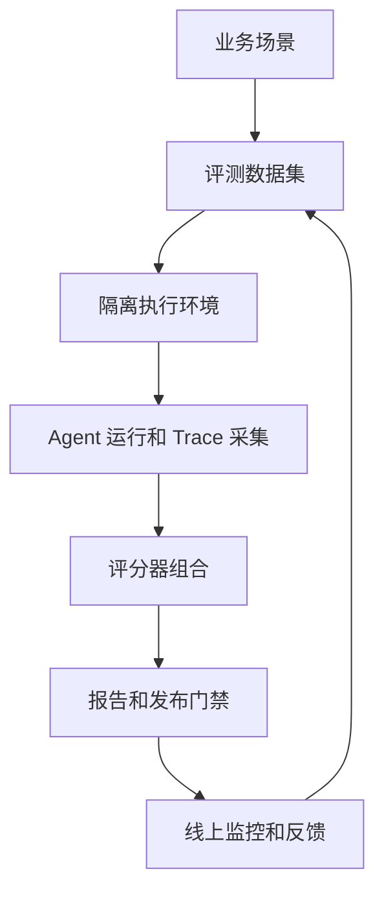

# Agent评估总览

## 1. 评估对象

### 1.1 从回答到行为

Agent 评估关注完整任务行为，而非只看最终文本。一次真实任务包含用户输入、模型决策、工具调用、环境状态变化、错误恢复、最终产物和用户反馈。最终回答写得流畅，不代表业务动作正确完成。

例如客服 Agent 说“退款已完成”，还要检查订单系统状态、退款金额、审批策略和用户通知。代码 Agent 说“测试通过”，还要检查测试命令、退出码、修改文件和剩余风险。

### 1.2 核心概念

| 概念 | 含义 | 关注点 |
| --- | --- | --- |
| Task / Case | 一个具体业务任务 | 输入、环境、成功标准 |
| Trial | Agent 对任务的一次尝试 | 非确定性、重试、成本 |
| Trace / Trajectory | 完整执行轨迹 | 决策、工具、状态、错误 |
| Outcome | 最终业务状态 | 目标是否真正完成 |
| Evaluator | 评分逻辑 | 稳定性、成本、校准 |
| Evaluation Suite | 一组评测任务 | 覆盖度、版本和门禁 |

Agent eval 的最小闭环是：任务输入、Agent 循环、环境变化、轨迹记录、评分器、聚合报告。缺少轨迹时，失败很难归因；缺少最终状态检查时，文本质量可能掩盖业务错误。

## 2. Capability 与 Regression

### 2.1 两类目的

| 类型 | 目标 | 用途 |
| --- | --- | --- |
| Capability Eval | 衡量新能力和困难场景 | 指导模型、工具、prompt、流程优化 |
| Regression Eval | 防止已掌握能力倒退 | CI/CD 门禁、模型升级、回归防护 |

新场景通常先进入 capability suite。稳定通过后，再迁移到 regression suite。线上事故、高风险失败和安全违规应直接进入 regression 或 safety suite。

### 2.2 非确定性

Agent 具有非确定性。同一任务在不同采样、工具返回和上下文状态下可能成功也可能失败。`pass@k` 衡量 k 次尝试中至少一次成功，适合允许多次探索的任务。`pass^k` 衡量 k 次尝试都成功，适合要求稳定可靠的任务。

这两个指标需要结合业务语境。金融、权限、生产写入等场景更关注稳定成功率和首轮成功率。研究草案、代码候选和复杂分析可以使用多次尝试估计潜力。

## 3. 评估闭环

### 3.1 生命周期

这条闭环把离线评测和线上反馈连接起来。线上低分 trace、用户反馈、人工接管和安全告警应回流为新用例。

### 3.2 建设顺序

第一阶段先选高价值场景，建立少量高信号用例。第二阶段补齐 trace 和自动评分。第三阶段把线上失败回流到 replay suite。第四阶段接入发布门禁、canary 和 A/B。评估体系应伴随 Agent 一起迭代。

## 参考资料

- [Anthropic: Demystifying evals for AI agents](https://www.anthropic.com/engineering/demystifying-evals-for-ai-agents)
- [AWS: Evaluating Deep Agents using LangSmith on AWS](https://aws.amazon.com/cn/blogs/machine-learning/evaluating-deep-agents-using-langsmith-on-aws/)
- [AgentBench: Evaluating LLMs as Agents](https://arxiv.org/abs/2308.03688)
