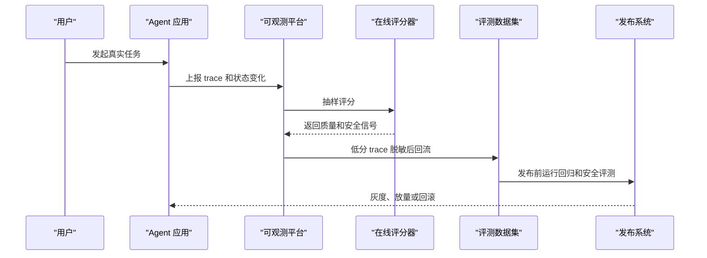

# 反馈闭环与发布门禁

## 1. 从线上反馈到回归用例

### 1.1 闭环流程

线上反馈包括用户差评、人工接管、工具失败、异常成本、安全告警和业务状态错误。高价值失败应转成可复现用例，而非只停留在工单描述。

### 1.2 优先级

| 优先级 | 条件 | 处理 |
| --- | --- | --- |
| P0 | 安全、合规、财务、越权、不可逆写操作 | 阻断发布，进入 safety/regression |
| P1 | 高频主路径失败、关键客户失败 | 快速转用例并修复 |
| P2 | 用户体验下降、长尾可复现 | 批量进入 capability/replay |
| P3 | 低影响、偶发、暂不可复现 | 聚类观察 |

## 2. 发布门禁

### 2.1 三类指标

硬阻断指标包括隐私泄露、越权写操作、危险工具调用、关键业务状态错误和无法审计的 trace 缺失。核心质量指标包括关键任务成功率、回归通过率、策略遵守率和人工接管率。运营效率指标包括延迟、token 成本、工具调用次数和吞吐。

门禁要看风险等级和历史基线。新版本若在核心场景退步，应进入复核，即使总体平均分仍然可观。

### 2.2 上线策略

1. 离线门禁：critical regression、safety suite、smoke suite 通过。
2. 影子流量：新版本只评分，不影响用户。
3. 小流量 canary：观察质量、成本、安全和人工接管。
4. A/B 实验：对关键业务指标做对比。
5. 逐步放量：按场景或用户群扩大覆盖。
6. 上线复盘：把失败样本纳入 replay suite。

## 3. AgentOps 路线

### 3.1 建设阶段

| 阶段 | 目标 |
| --- | --- |
| 0-4 周 | 建立最小用例集、trace 和离线评测 |
| 1-3 个月 | 接入回归门禁和线上失败回流 |
| 3-6 个月 | 形成评测平台和质量仪表盘 |
| 6-12 个月 | 建立 AgentOps 治理和跨团队协作 |

### 3.2 组织分工

产品定义成功标准，领域专家提供政策和边界样本，数据工程负责日志回流和脱敏，Agent 工程维护工具和 Runtime，QA 维护回归用例，SRE 负责可观测性、告警和回滚。

## 参考资料

- [Anthropic: Demystifying evals for AI agents](https://www.anthropic.com/engineering/demystifying-evals-for-ai-agents)
- [AWS: Evaluating Deep Agents using LangSmith on AWS](https://aws.amazon.com/cn/blogs/machine-learning/evaluating-deep-agents-using-langsmith-on-aws/)
- [OpenTelemetry GenAI Semantic Conventions](https://opentelemetry.io/docs/specs/semconv/gen-ai/)
