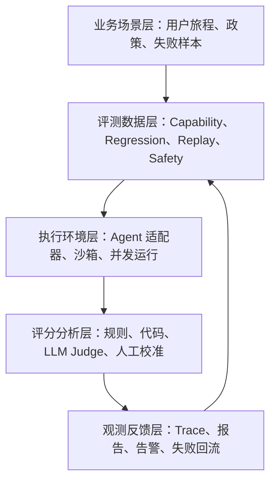

# 自动化评测框架

## 1. 分层架构

### 1.1 五层能力

这五层把用例、执行、评分和反馈连成闭环。工具选型应服务这些层，而非一次性堆满平台。

### 1.2 核心模块

| 模块 | 职责 |
| --- | --- |
| Case Registry | 管理用例、版本、标签和 owner |
| Environment Manager | 构建干净初始状态 |
| Agent Adapter | 统一调用不同 Agent 版本 |
| Runner | 并发运行 trial，控制超时和重试 |
| Trace Collector | 采集消息、工具、检索、成本、延迟 |
| Grader Engine | 执行规则、代码、模型和人工评分 |
| Experiment Store | 存储结果、轨迹和产物 |
| Quality Gate | 判断是否允许发布 |

## 2. 运行模式

### 2.1 评测触发

| 模式 | 触发 | 目标 |
| --- | --- | --- |
| PR Smoke | 代码或 prompt 变更 | 快速发现明显破坏 |
| Nightly Regression | 每晚 | 检测稳定性和漂移 |
| Capability Benchmark | 版本里程碑 | 衡量能力提升 |
| Model Bakeoff | 新模型候选 | 比较质量、成本、延迟 |
| Safety Gate | 发布前 | 阻断高风险变更 |
| Production Replay | 事故后或每周 | 验证线上失败修复 |

不同运行模式使用不同数据集。高风险 regression 应频繁运行，低通过率 capability 可以放在 nightly 或版本评审。

### 2.2 评测粒度

单步决策评测检查下一步工具或澄清是否正确。完整任务评测检查最终状态。多轮评测使用用户模拟器。线上评测对真实 trace 抽样评分。四种粒度互补，不能互相替代。

## 3. 工具落位

### 3.1 最低可行方案

小团队可以先用 Git 管理 JSONL 或 Markdown 用例，用脚本或 pytest 运行评测，用 Docker 保证基础隔离，把结果输出为 JSON 和 Markdown 报告。等用例和 trace 增多后，再引入 LangSmith、Phoenix、Langfuse、Harbor 或内部平台。

### 3.2 发布门禁

Quality Gate 应支持硬阻断和趋势比较。安全违规、越权动作、关键状态错误和 trace 缺失应直接阻断。任务成功率、成本和延迟应与历史基线比较。

## 参考资料

- [Harbor Framework](https://github.com/harbor-framework/harbor)
- [LangSmith Evaluations](https://docs.smith.langchain.com/evaluation)
- [Arize Phoenix](https://arize.com/docs/phoenix)
- [Raindrop Workshop](https://github.com/raindrop-ai/workshop)
